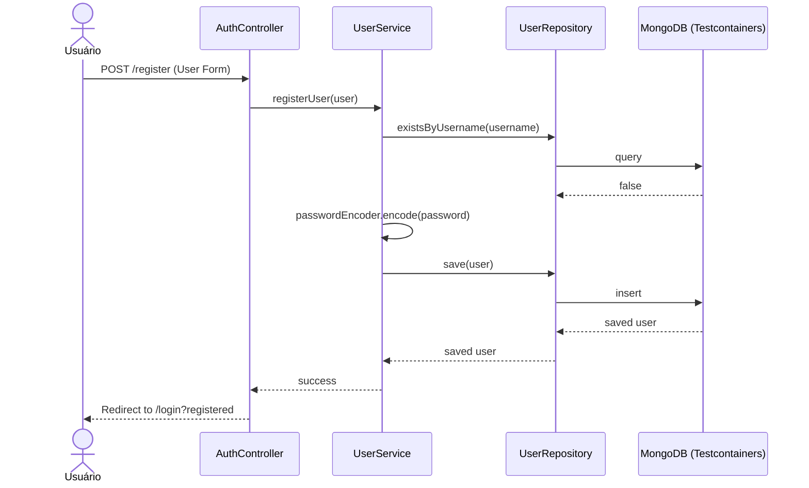
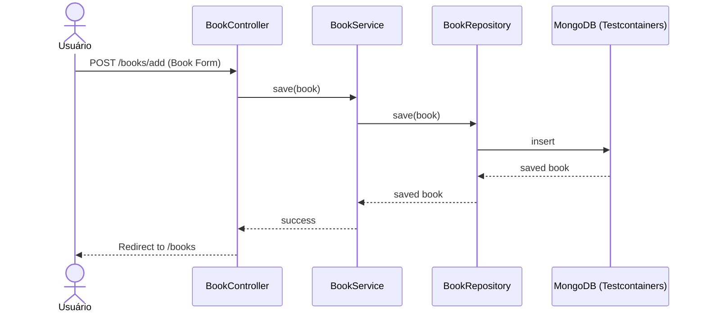
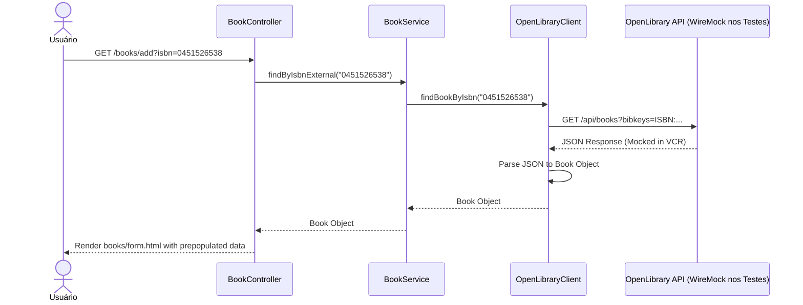

# Matriz de Rastreabilidade de Requisitos (RTM)

## Tabela de Rastreabilidade

| ID Req | Descrição do Requisito Funcional | Tipo de Teste (Local) | Ferramentas | Status |
|---|---|---|---|---|
| **RF01** | O sistema deve permitir o cadastro de novos usuários no banco MongoDB. | Teste de Integração Parametrizado, Caixa Branca | JUnit, Testcontainers | Concluído |
| **RF02** | O sistema deve garantir que o nome de usuário seja único. | Teste de Integração | JUnit, Testcontainers | Concluído |
| **RF03** | O sistema deve permitir login de usuários cadastrados gerenciando a sessão. | Teste E2E (Controller) | MockMvc, Testcontainers | Concluído |
| **RF04** | O sistema deve impedir o acesso a rotas privadas para usuários não autenticados. | Teste E2E (Controller) | MockMvc, Testcontainers | Concluído |
| **RF05** | O sistema deve realizar operações de CRUD (Criar, Ler, Atualizar, Deletar) para Livros. | Teste E2E (Controller) / Integração | MockMvc, Testcontainers | Concluído |
| **RF06** | O sistema deve permitir a busca de um livro por ISBN utilizando API externa. | Teste de Integração (VCR) | JUnit, WireMock | Concluído |

---

## Diagramas UML de Sequência

### RF01 e RF02: Cadastro de Usuário

### RF03 e RF04: Autenticação e Restrição

### RF05: Adicionar Livro (CRUD)

### RF06: Buscar Livro por ISBN (API Externa com VCR)

