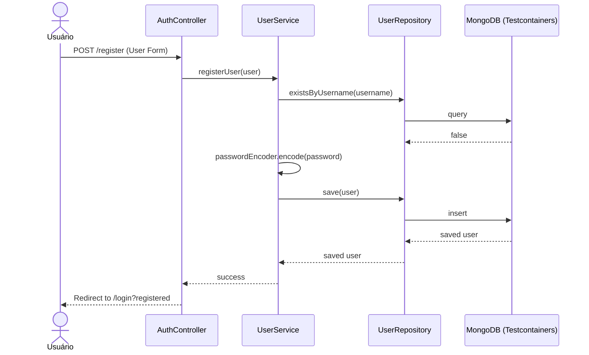
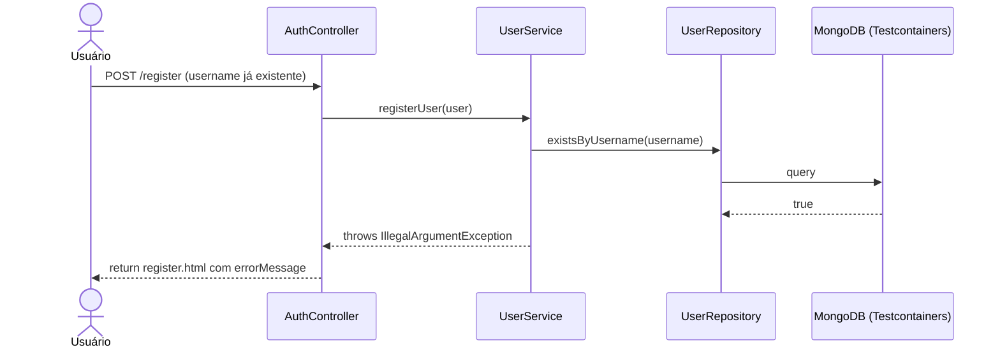
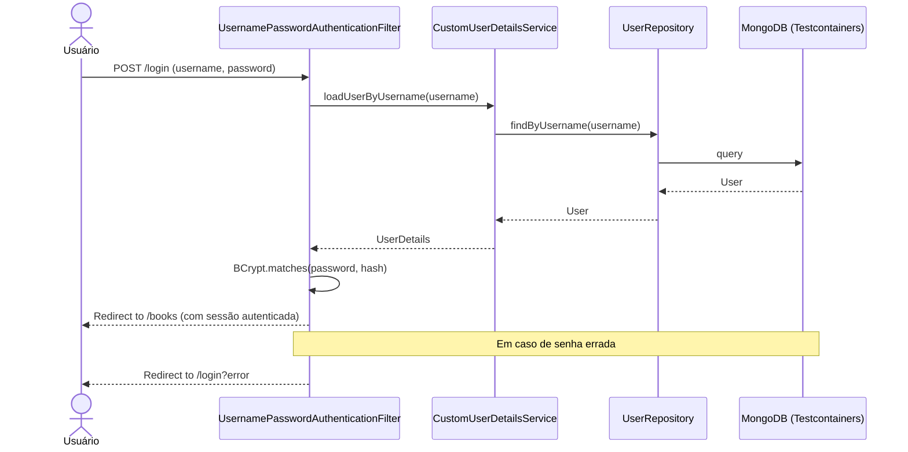
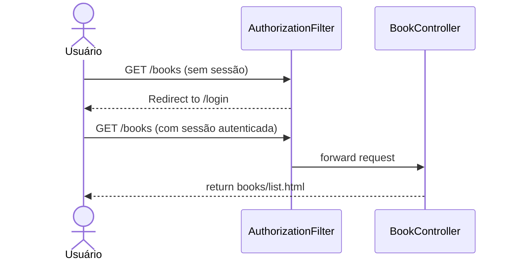
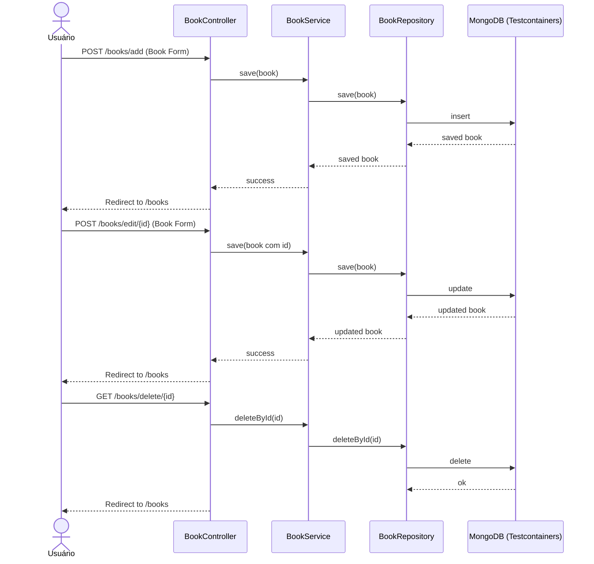
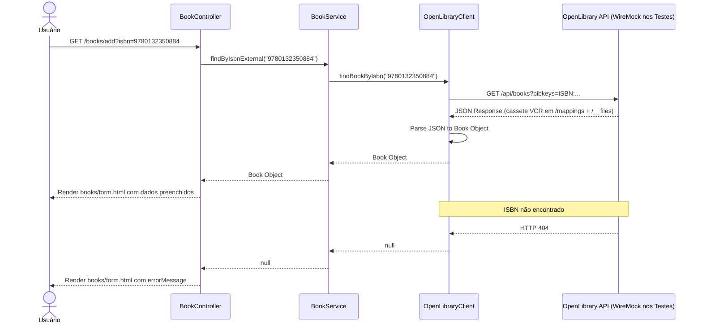

# Matriz de Rastreabilidade de Requisitos (RTM)

## Tabela de Rastreabilidade

| ID Req | Descrição do Requisito Funcional | Tipo de Teste | Classe(s) de Teste | Métodos de Teste | Ferramentas | Status |
|---|---|---|---|---|---|---|
| **RF01** | O sistema deve permitir o cadastro de novos usuários no banco MongoDB. | Integração Parametrizado, Caixa Branca, E2E | `UserServiceTest`, `AuthControllerE2ETest` | `registerUser_ShouldHashPasswordAndSave`, `registerUser_MultipleUsers_ShouldSaveAll`, `processRegistration_ShouldRedirect_WhenValidData`, `processRegistration_ShouldReturnRegister_WhenPasswordTooShort`, `processRegistration_ShouldReturnRegister_WhenFieldsAreBlank` | JUnit, Testcontainers, WireMock | Concluído |
| **RF02** | O sistema deve garantir que o nome de usuário seja único. | Integração, E2E | `UserServiceTest`, `AuthControllerE2ETest` | `registerUser_ShouldThrowExceptionIfUsernameExists`, `processRegistration_ShouldShowError_WhenUsernameAlreadyExists` | JUnit, Testcontainers | Concluído |
| **RF03** | O sistema deve permitir login de usuários cadastrados gerenciando a sessão. | E2E (Controller), Caixa Preta | `AuthControllerE2ETest` | `login_ShouldRedirectToBooks_WhenValidCredentials`, `login_ShouldRedirectToError_WhenInvalidCredentials` | JUnit, Testcontainers, Spring Security | Concluído |
| **RF04** | O sistema deve impedir o acesso a rotas privadas para usuários não autenticados. | E2E (Controller), Caixa Preta | `BookControllerE2ETest` | `listBooks_ShouldReturnRedirect_WhenNotAuthenticated` | JUnit, Testcontainers, Spring Security | Concluído |
| **RF05** | O sistema deve realizar operações de CRUD (Criar, Ler, Atualizar, Deletar) para Livros. | E2E (Controller), Caixa Preta | `BookControllerE2ETest`, `BookControllerExtendedE2ETest` | `listBooks_ShouldReturnBooks_WhenAuthenticated`, `addBook_ShouldSaveBook_WhenValidFormSubmitted`, `addBook_ShouldReturnForm_WhenValidationFails`, `showEditForm_ShouldReturnFormWithBook`, `updateBook_ShouldSaveAndRedirect_WhenValidData`, `updateBook_ShouldReturnForm_WhenValidationFails`, `deleteBook_ShouldDeleteAndRedirect` | JUnit, Testcontainers | Concluído |
| **RF06** | O sistema deve permitir a busca de um livro por ISBN utilizando API externa. | Integração (VCR), E2E (VCR), Caixa Preta | `BookServiceTest`, `BookControllerExtendedE2ETest` | `findBookByIsbnExternal_ShouldReturnBook_WhenApiReturnsData`, `showAddForm_ShouldReturnEmptyForm_WhenNoIsbn`, `showAddForm_ShouldFillForm_WhenIsbnFoundInApi`, `showAddForm_ShouldShowError_WhenIsbnNotFoundInApi` | JUnit, Testcontainers, WireMock (VCR programático e declarativo) | Concluído |

---

## Estratégia de Autenticação nos Testes

Todos os testes de controller que exigem autenticação utilizam **login real via `POST /login`**, sem qualquer atalho sintético. O fluxo completo é exercitado a cada teste:

1. O `@BeforeEach` faz `POST /login` com credenciais reais
2. O `UsernamePasswordAuthenticationFilter` do Spring Security processa a requisição
3. O `CustomUserDetailsService` consulta o MongoDB real (Testcontainers)
4. O BCrypt verifica a senha
5. A sessão autenticada (`MockHttpSession`) é capturada e reutilizada nos testes

Não há uso de `@MockBean`, `@Mock`, `Mockito.mock()` ou `SecurityMockMvcRequestPostProcessors.user()` em nenhuma classe de teste.

---

## Diagramas UML de Sequência

### RF01 e RF02: Cadastro de Usuário

### RF02: Username Duplicado

### RF03: Login e Gerenciamento de Sessão

### RF04: Restrição de Acesso a Rotas Privadas

### RF05: CRUD de Livros

### RF06: Buscar Livro por ISBN (API Externa com VCR)
