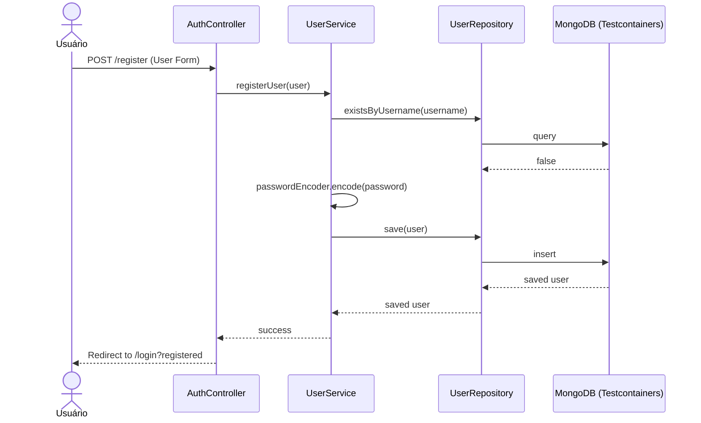
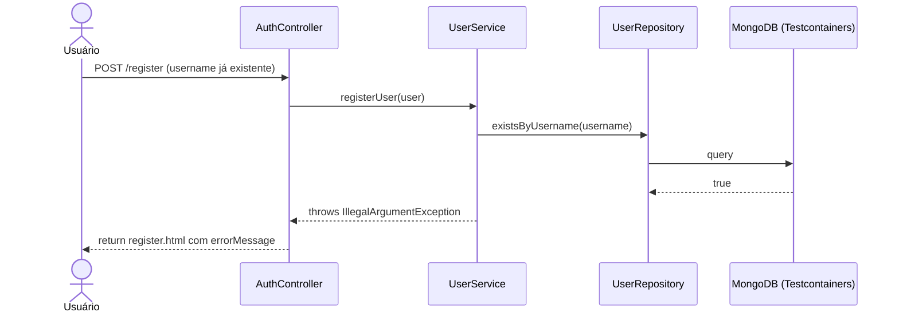
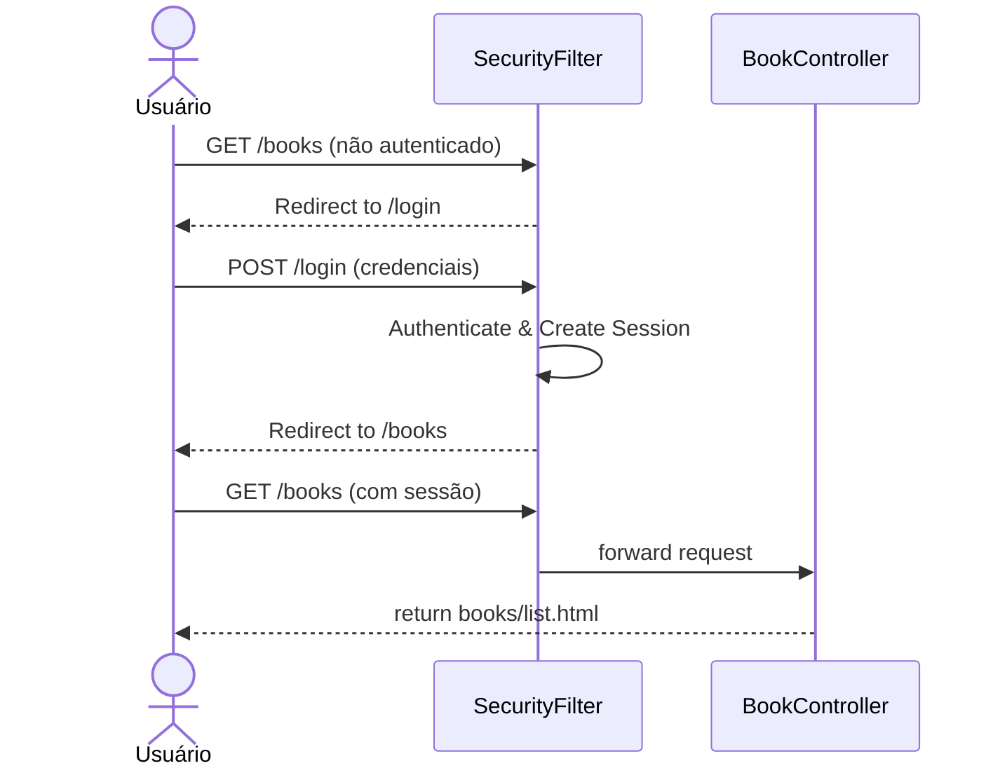
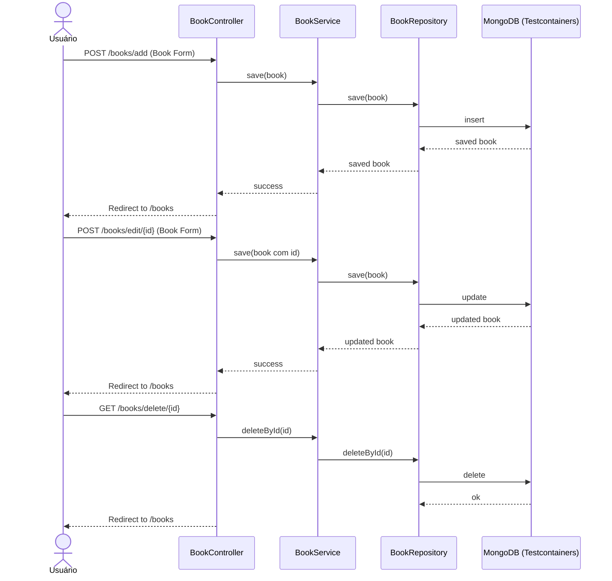
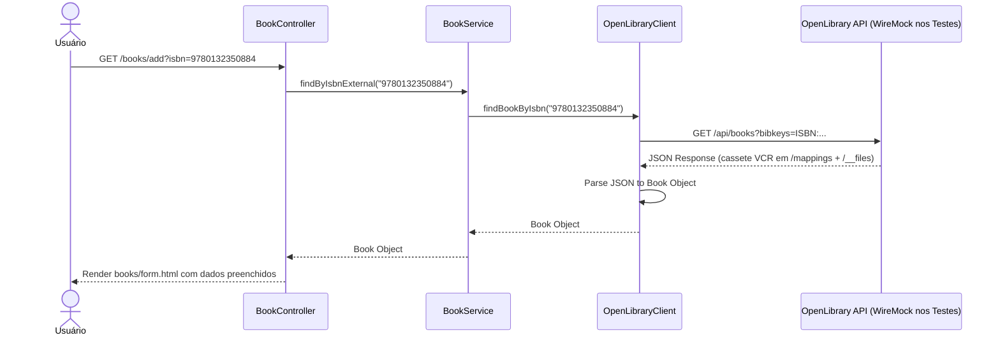

# Matriz de Rastreabilidade de Requisitos (RTM)

## Tabela de Rastreabilidade

| ID Req | Descrição do Requisito Funcional | Tipo de Teste | Classe(s) de Teste | Ferramentas | Status |
|---|---|---|---|---|---|
| **RF01** | O sistema deve permitir o cadastro de novos usuários no banco MongoDB. | Integração Parametrizado, Caixa Branca, E2E | `UserServiceTest`, `AuthControllerE2ETest` | JUnit, Testcontainers, MockMvc | Concluído |
| **RF02** | O sistema deve garantir que o nome de usuário seja único. | Integração, E2E | `UserServiceTest`, `AuthControllerE2ETest` | JUnit, Testcontainers, MockMvc | Concluído |
| **RF03** | O sistema deve permitir login de usuários cadastrados gerenciando a sessão. | E2E (Controller) | `AuthControllerE2ETest` | MockMvc, Testcontainers | Concluído |
| **RF04** | O sistema deve impedir o acesso a rotas privadas para usuários não autenticados. | E2E (Controller) | `BookControllerE2ETest` | MockMvc, Testcontainers | Concluído |
| **RF05** | O sistema deve realizar operações de CRUD (Criar, Ler, Atualizar, Deletar) para Livros. | E2E (Controller) | `BookControllerE2ETest`, `BookControllerExtendedE2ETest` | MockMvc, Testcontainers | Concluído |
| **RF06** | O sistema deve permitir a busca de um livro por ISBN utilizando API externa. | Integração (VCR), E2E (VCR) | `BookServiceTest`, `BookControllerExtendedE2ETest` | JUnit, WireMock | Concluído |

---

## Diagramas UML de Sequência

### RF01 e RF02: Cadastro de Usuário

### RF02: Username Duplicado

### RF03 e RF04: Autenticação e Restrição de Acesso

### RF05: CRUD de Livros

### RF06: Buscar Livro por ISBN (API Externa com VCR)
